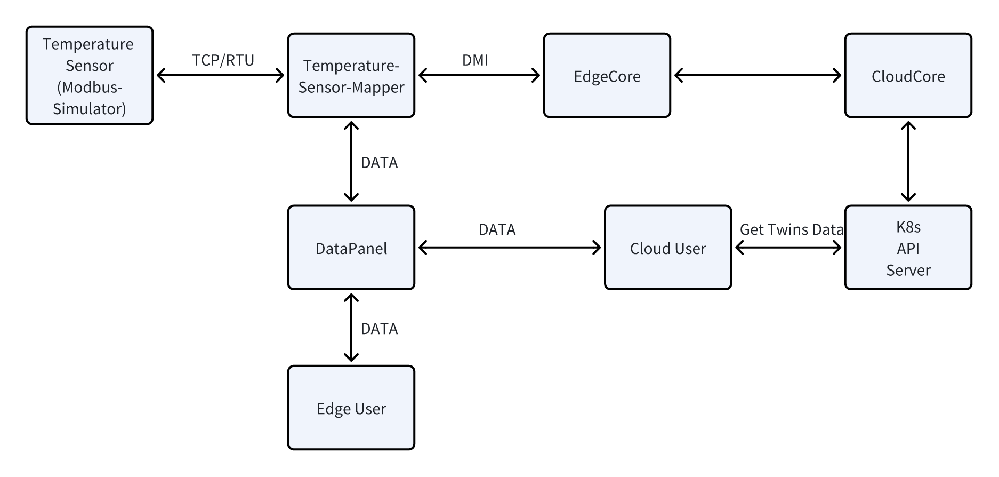
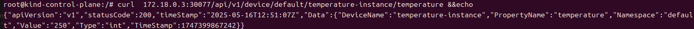

# Temperature Sensor Modbus Mapper Plugin

This project is a Modbus protocol temperature sensor management plugin based on KubeEdge, which implements data collection, status reporting and control functions for temperature sensors.

## Functional Features

- Support Modbus TCP and RTU communication modes
- Implement temperature data collection and reporting
- Support temperature alarm threshold setting
- Provide RESTful API interface for device control and data query
- Support real-time monitoring of device status

## System Architecture

This plugin is developed based on KubeEdge's Mapper framework, and communicates with temperature sensors through the Modbus protocol to realize device data collection and control. The system architecture is as follows:



## Prerequisites

- KubeEdge environment (v1.12.0 or higher)
- Go 1.22.0 or higher
- Modbus Simulator

## Quick Start

### 1. Clone the repository to local
```
git clone https://github.com/aAAaqwq/temperature-sensor-mapper
```

### 2. Configure Modbus simulation software (if conditions permit, physical devices can be used)
```
Install modbus Slave (recommended)
- Create TCP/RTU device connection, mapper uses TCP protocol by default.
- Configure Modbus registers:
- Temperature register: holding register, address 4000, data type: uint16
- Working status register: coil register, address 1001, data type: uint16
```

### 3. Configure mapper plugin
- Configure /crds/temperature-instance.yaml
```
1. replace the ip with your modbus device ip 
2. replace the nodeName with your edge node name
```
- Configure /resource/deployment.yaml
```
1. replace the nodeName with your edge node name
```
### 4. Build mapper plugin image at Edge
```
make docker-build
```

### 5. Deploy mapper and crds
```
make deploy
```
### 6. Verify plugin function
#### 6.1 View the synchronization of the reported field in the twins field:
```
kubectl get device -o yaml
```
#### 6.2 Access the REST API of the mapper plugin on the edgecore node
- Health check
```
curl 127.0.0.1:7777/api/v1/ping
```
- Get device status
```
curl <your_edge_ip>:30077/api/v1/device/<namespace>/<device_name>/<property_name>
```


#### 6.3 View mapper logs

### 7. Uninstall the plugin
```
make clean
```
